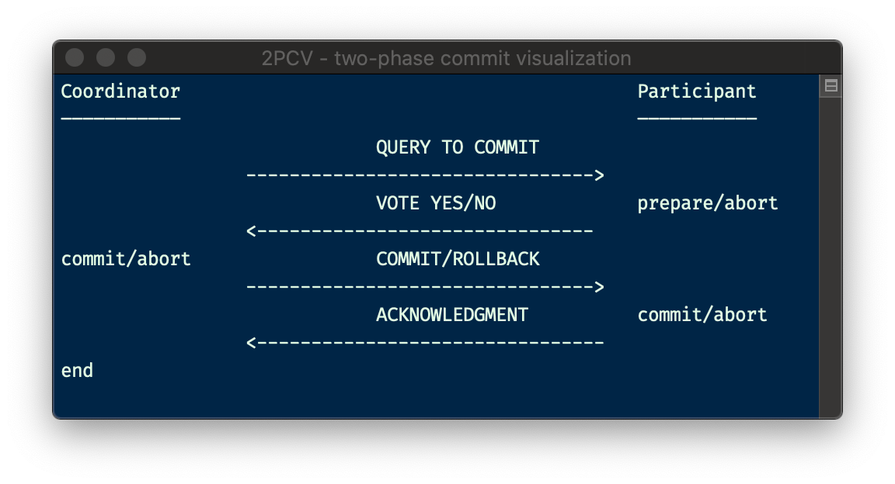
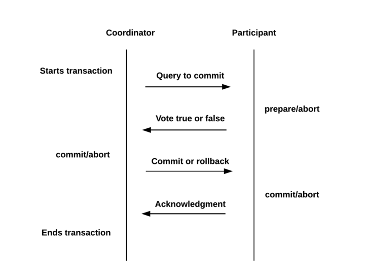
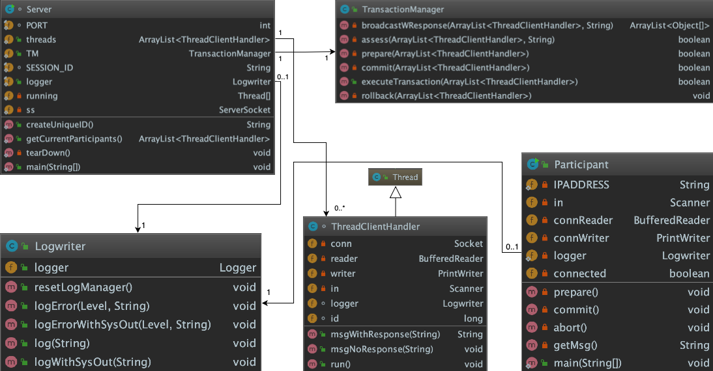
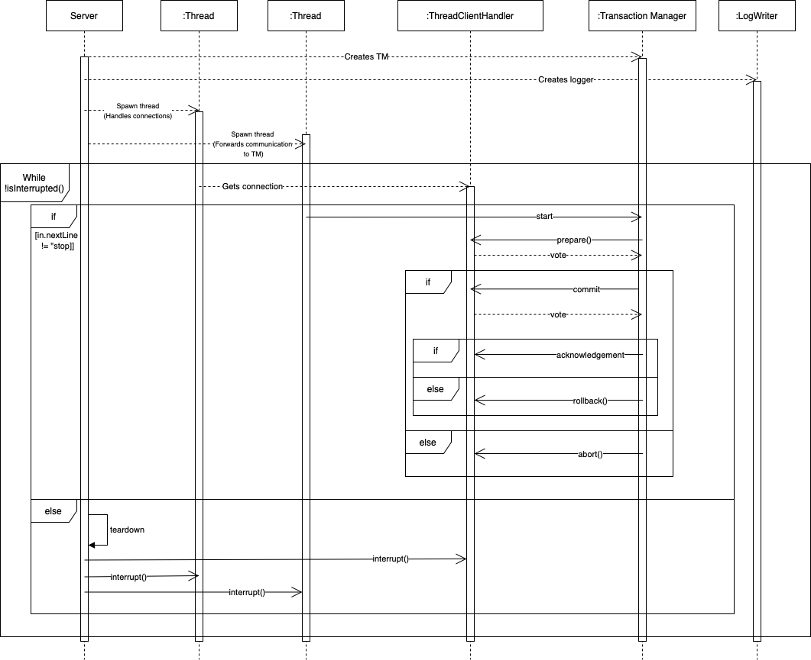
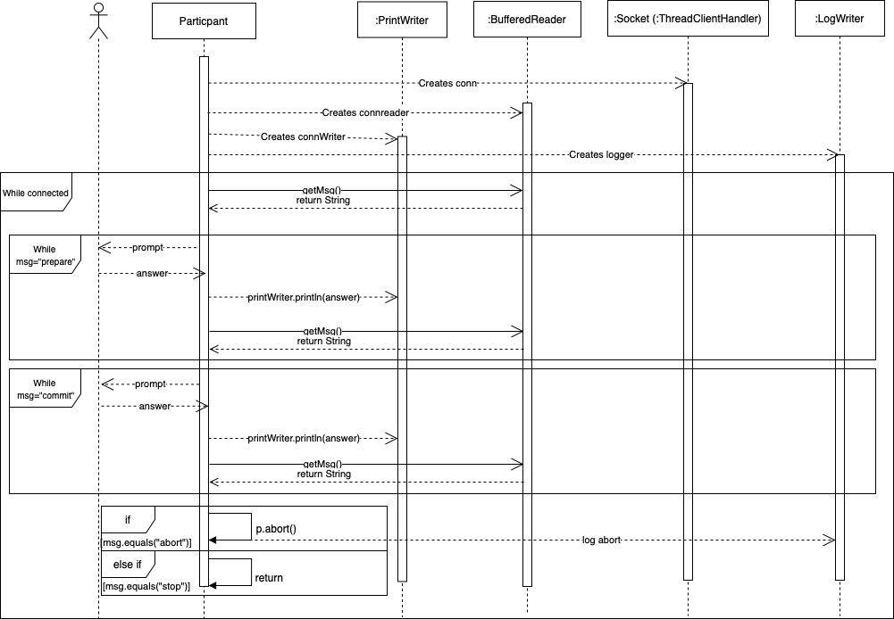
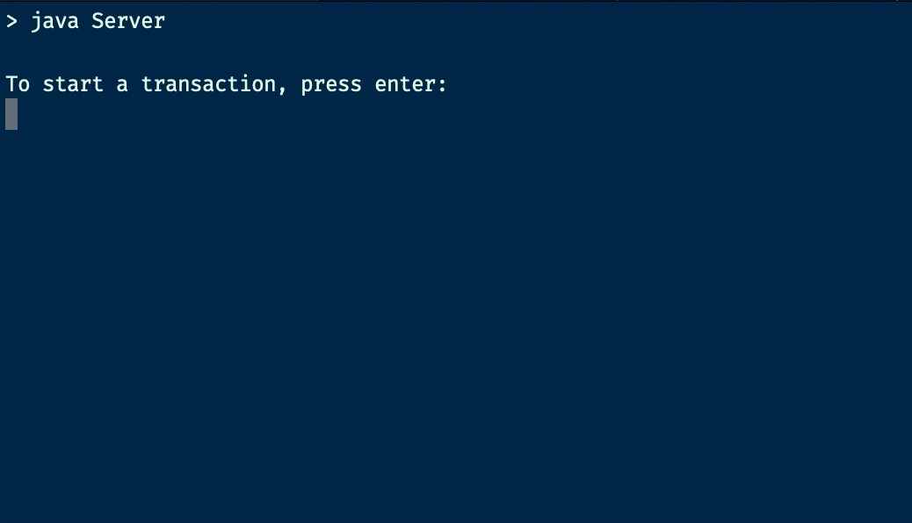
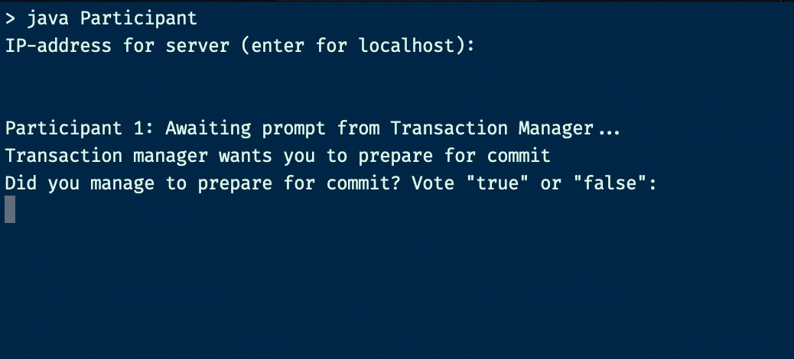
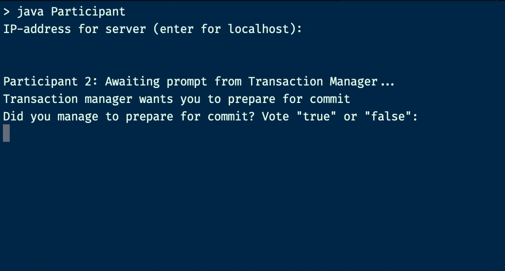
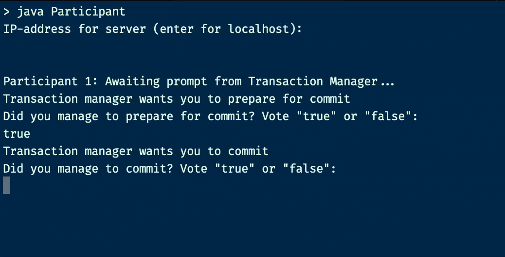
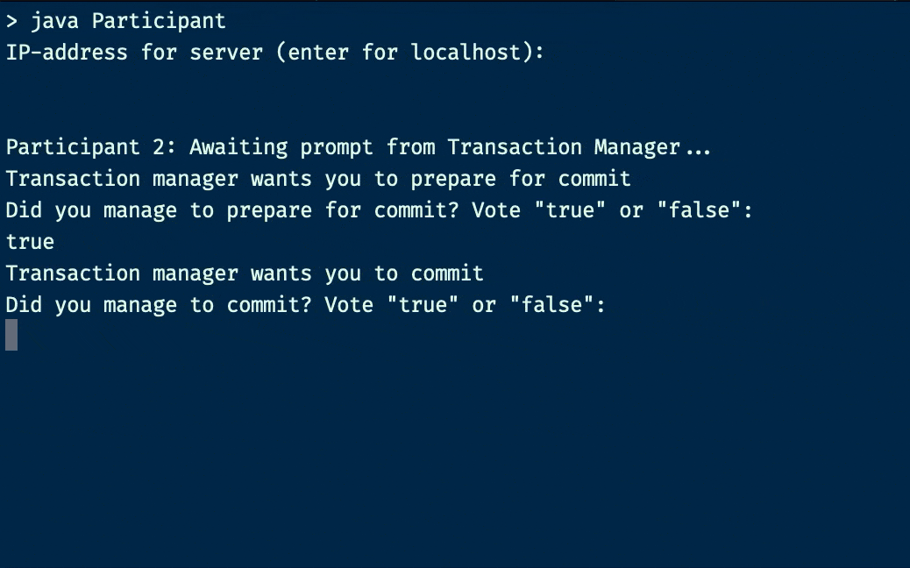

# 2PCV

2PCV - or two-phase commit visualisation, is a program made to simulate the two-phase commit protocol in practice. It gives you the option to abort the transaction in both phases - or successfully commit a transaction involving multiple participants.

---
#### Table of contents
1. [The protocol](#the-protocol)
2. [Our solution](#our-solution)
3. [Class diagram](#class-diagram)
4. [Sequence diagram](#sequence-diagram)
5. [Implemented functionality](#implemented-functionality)
6. [Choices we've made](#choices)
7. [Possible future improvements](#possible-future-improvements)
8. [Installation](#installation)
9. [Running the program](#running-the-program)
    1. [An example which will abort](#an-example-which-will-abort)
    2. [An example which will commit](#an-example-which-will-commit)
10. [JavaDoc](#javadoc)
11. [Litterature](#litterature)
12. [Authors](#authors)

---

#### The protocol 

The two-phase commit protocol is a protocol mainly consisting of two phases; prepare and commit. The ultimate goal of the protocol is to ensure lossless, atomic transactions between multiple separate nodes. This is often useful in distributed systems.

To accomplish this the protocol starts a transaction with the preparation phase. During this phase a node declared as the **coordinator*** prompts every **participant**** to prepare their resources and finish necessary work before the coming commit phase.
The coordinator waits for a response from every participant involved in the transaction before proceeding to the next phase. Should a participant time out or otherwise fail during this phase, the coordinator will stop the transaction and prompt the participants to abort the transaction.
This is accomplished by implementing the prompt to prepare as a vote where each participant answers with a value corresponding to a failed or successful preparation phase. If all the participants answers are positive, the transaction proceeds.

The second phase is the commit-phase. Now that the coordinator has verified that all participants are ready to commit, it sends a message to all participants prompting them to commit.
The participants should then answer the coordinator with some form of an acknowledged message, letting it know that the commit was succesful. If the commit failed for a participant, it should be attempted (within reason) again for this participant.
If all participants acknowledge and complete the commit, the transaction has succeeded and is now over.

\* The coordinator is a node tasked with the coordination of this transaction. It handles the voting and the tallying of the votes as well as the synchronisation of the participants involved. The coordinator initiates the process and terminates it when it is done. It also coordinates rollbacks and aborts should the transaction fail at any stage.

\*\* A participant can be any type of node holding some kind of resource relevant to the transaction at hand. These can also be coordinators, but this is not the case in our implementation.



---

### Our solution 
#### Server
First off we made a server with the main purpose of being the backbone of the system. It has two main tasks; to create and manage the connection with each participant, and give the execute-message to the transaction manager when the user wants to start a transaction.

#### Participants
The participants is as mentioned in the protocol-description the ones doing the actual preparing and committing. A participant has one given task to perform (possibly accessing a resource manager in practice); it prepares a commit and sends a vote back to the coordinator, in addition to commiting if every vote returns true.

#### Transaction Manager
This is the coordinator. In this class all the stages of the transaction are taken care of by communicating with the participants and taking decisions based on their votes. 

#### Logwriter
The Logwriter manages the logs of both the server/coordinator and the participants.

#### Class diagram


#### Sequence diagram 
##### Server


##### Participant


> For a further explanation of the classes and their methods, check out the JavaDoc!

---

### Implemented functionality 

Our solution has the following functionality:
- A fully working two-phase commit visualisation.
- The possibility to connect separate machines to run the solution as a distributed system.
- Handling participant failure, preventing one participant from affecting all others. (Individual failure)
- Preventing a new participant to participate in a transaction not meant for them, but rather being included in the next transaction started by the coordinator.
- Retrying the transaction for failed participants (within reason). If a max retry limit is reached, the transaction will be aborted for all participants.
- Concise and precise feedback during the transaction process explaining the program flow of each phase.


### Technological, architectural and design related choices we've made <a name="choices"></a>

This section will discuss the different techonological and design related choices we have considered, and eventually settled on during the making of our final solution.

#### Class structure and modularity
Our class structure was designed with low cohesion in mind. Each class has its own distinct task to complete and watch over. Good examples of this are the classes "TransactionManager" and "ThreadClientHandler". The TransactionManager is our solutions coordinator and is run on the machine serving as the systems server. It is tasked with coordinating and synchronising transaction calls and execution or the termination and rollback of these. To do so, the TransactionManager needs a way to communicate with each individual participant for each transaction. This is solved by the ThreadClientHandler class which offers a ThreadClientHandler object with a dedicated I/O-stream accompanied by a reader and writer. The class also has methods making the use of the reader and writer easy and almost free of boilerplate code. Together the modularity of the classes makes future improvements easy to implement. Refactoring should also be quite easy due to this approach. 

#### Connecting participants to the coordinator
When considering how we should connect the client and server side, the choice fell on TCP/IP-sockets. We needed a reliable way of transferring the queries sent between the clients and the server. This was because we wanted to prevent the loss of data causing a party to believe the other had disconnected or otherwise failed. This could be circumvented by sending multiple UDP packets after not receiveing an acknowledgement inside a certain time frame, but this would result in unnecessary added complexity. Considering the rate at which we transfer data, we did not view it as necessary to try to eliminate the overhead that follows the use of TCP/IP over UDP. Both group members were also more familiar with the use of Javas Socket and ServerSocket packages than the DatagramSocket package, which made the choice easier.

#### Why threading?
We utilized threading in our solution due to the need for concurrency in the application. In a real world implementation, one could make an argument against the necessity of concurrency during the transaction since it would be transparent to the user of the system. A participant would then vote and just wait until the coordinator reaches their node and tallies their vote. Our case is a little different in the sense that we are supposed to make a visualisation of the protocol. To make everything clear and understandable it makes sense to provide each user with an instantaneous response after they have submitted their vote. Not receiving a response from the server could therefore confuse users of the system.  
We would argue that there is a place and a need for thread use in the application, regardless of it being a visualisation or a fully functional implementation of the two-phase commit protocol. This would be the case for the file "Server.java" where we separate the handling of connections and transaction handling into two individual threads. This is because a participant should not be disallowed from connecting to the service even though a transaction is ongoing. This ties into the argument of confusement mentioned above. Likewise, a transaction should not be delayed as a consequence of a participant attempting to connect.

Another aspect to consider is the amount of threads used during program execution. Our implementation spawns a new thread for each participant involved in the transaction. It also spawns another thread for each of these participants during the voting phase, because of the concurrency argument from earlier. This makes it so we create 2n threads, which could be quite taxing on a system should there be just one coordinator and a sufficient amount of participants. A solution to this problem could be the use of thread-pooling. Thread-pooling would also limit the rather expensive operation of creating threads to a reasonable amount. We have therefore added this as a bullet point to our future improvements section.

#### Choice of programming language
We chose to use Java as we are both most experienced writing code in this language. In addition to this, Java is widely used and based on the thoughts of *write once, run anywhere* (WORA). This means that our system will work on most computers regardless of the computer architecture, because of the usage of *JVM*, Java Virtual Machine. Meanwhile we could have chosen to work with for example C or C++, which holds even more low-level facilities and also shares some similarities regarding syntax, we did not see the need of that extra low-level capabilities. Further on we have chosen technologies supported in both Java 8 and Java 11, which are supporting long-term support (LTS) and therefore is maintained for a longer period of time than standard editions. This means that you dont have to worry about the software failing to compile nor run because of deprecated features. Finally, we decided that it is good to use a language we are both comfortable using, a language we have used a lot in the course this project is part of, and a language we know will serve us well with the features we need. 

#### Logger
We were in need of a way to create logs for debugging, in addition to storing session data for later use. As we read about the protocol, we discovered an important step in accommodating recovery from failure (maybe even automatic), and for this it was essential to store data for each part of the transaction. Even though we decided to only vizualise the protocol with user input, instead of managing a database or another resource, we wanted to add the functionality of both coordinator-logs, and participant-logs. For these logs we used the framework included in Java, Logger, in which we implemented in our own class LogWriter. Logger gives us the possibility to use both levels and include timestamps for a better overview of what has been done during execution of the program. 

### Possible future improvements

Things we could do in the future to improve the solution:
- Make the transaction part an implementable library for real transactions
- Improving the retry functionality on the participant side making it possible to pick up where they left. This would be useful in an actual implementation of the protocol. At the moment the participant just simulates a crash or error by sending the value false to the server. During a real crash, the client might have already said they were ready to commit, but it didnt go through. It would then be useful to immediatedly be able to retry the commit phase instead of retrying the entire transaction for that one participant. With out current implementation, this is not possible.
- Thread pooling when broadcasting to all participants. Our current implementation creates a thread for each participant involved in the transaction. With big distributed systems, this may lead to alot of threads on the coordinator machine. Another to remedy this could be to instead use multiple coordinator machines.
- Making the logs functional for future use. E.g. assist in recovery of previous states upon system failure.

### Installation
First of all, you need to have *Java JDK* installed. We recommend using the latest stable version, but we have tested that it works with versions down to Java 8.

> *Not sure which version you have?*
>
> Check it by running `java -version` 
> ```
> > java -version
> java version "11.0.2" 2019-01-15 LTS
> Java(TM) SE Runtime Environment 18.9 (build 11.0.2+9-LTS)
> Java HotSpot(TM) 64-Bit Server VM 18.9 (build 11.0.2+9-LTS, mixed mode)
> ```

Then you have to download our source-files. The easiest option here is to clone our project. To do this you open a terminal in your desired destination folder. Then you write the following commands into the terminal window:  
`git clone https://gitlab.stud.idi.ntnu.no/olejlia/twophasecommit.git`  
`cd twophasecommit`


## Running the program 

Assuming you have followed the above installation process, make your desired folder for the .class files you will run later. We reccomend making a separate folder for this to keep things tidy; eg:
> While situated in the root folder, make an out folder:
> `mkdir out`

Then compile the source files to your folder of choice:  
`cd src`  
`javac *.java -d ../out`

To run the program, go to your folder containing the <fileName>.class files and open a terminal for your coordinator, and one for each individual participant. If you are attempting to test the program with someone else, you can open the programs on separate computers, as long as you are connected to the same LAN and you know the coordinators IP-address. Proceed to run the program by typing the following into your terminals:
> Coordinator:  
> `java Server`

> Participants:  
> `java Participant`

---
### An example which will abort:
This example is running the system on one machine with localhost, but you may as well host the server on one machine and the participants on another, as long as you are on the same network.

##### Open up three terminals (`twophasecommit/out/`) and run the appropriate .class files

- Run `java Server` in terminal (1)


- Run `java Participant` in terminal (2)
and press enter.
> If the server is on another machine in the same network, enter its IP-address before pressing ENTER.


- Run `java Participant` in terminal (3)
and press enter.
> If the server is on another machine in the same network, enter its IP-address before pressing ENTER.


##### The transaction process:
- Press `enter` in terminal (1).
> This will prompt the participants to prepare and vote according to the outcome of their preparation phase.


- Type `true` in terminal (2) and press enter.
> This will send the vote 'true' to the coordinator, signalling that all went well.


- Type `false` in terminal (3) and press enter.
> This will send the vote 'false' to the coordinator, signalling that something went wrong while preparing.


This prompts the coordinator to call its retry method for this participant, halting the transaction process for all other participants until the error is resolved. The coordinator will retry up to 3 times before it concludes that the participant has failed permanently. This results in the coordinator calling abort as one of the participants did not manage to complete the step, resulting in all participants being notified of the failed transaction and asked to roll back.


---
### An example which will commit:
This example is running the system on one machine with localhost, but you may as well host the server on one machine and the participants on another, as long as you are on the same network.

##### Open up three terminals (`twophasecommit/out/`) and run the appropriate .class files

- Run `java Server` in terminal (1)


- Run `java Participant` in terminal (2)
and press enter.
> If the server is on another machine in the same network, enter its IP-address before pressing ENTER.


- Run `java Participant` in terminal (3)
and press enter.
> If the server is on another machine in the same network, enter its IP-address before pressing ENTER.


##### Now for the transaction:
- Press `enter` in terminal (1).
> This will prompt the participants to prepare and vote according to the outcome of their preparation phase.


- Type `true` in terminal (2) and press enter.
> This will send the vote 'true' to the transaction manager


- Type `true` in terminal (3) and press enter.
> This will send the vote 'true' to the transaction manager



Then all the participants will be prompted to commit and vote true/false depending on how it went
- Type `true` in terminal (2)
> This will send the acknowledegment 'true' to the transaction manager


- Type `true` in terminal (3)
> This will send the acknowledegment 'true' to the transaction manager



The transaction is now globally commited and the server is ready to start another transaction.


## JavaDoc
You can find the JavaDoc in the 'doc'-folder. Open it up in a selected browser of your choice. The comments is also to be found in each java-file.  

## Litterature
We have read chapter 9 in *Principles of Transaction Processing* for better understanding of the two-phase commit protocol

- E. Newcomer & P. A. Bernstein, *Principles of Transaction Processing*. Morgan Kaufmann Publishers, Inc. San Francisco, California

## Authors
This project is authored by:

<a href="https://github.com/MartinJohannesNilsen" target="_blank"></a>
<a href="https://github.com/OleJonas" target="_blank"></a>
